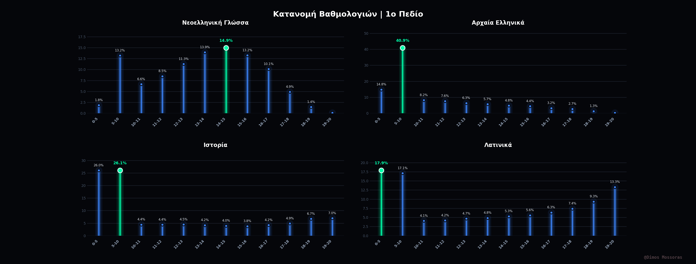
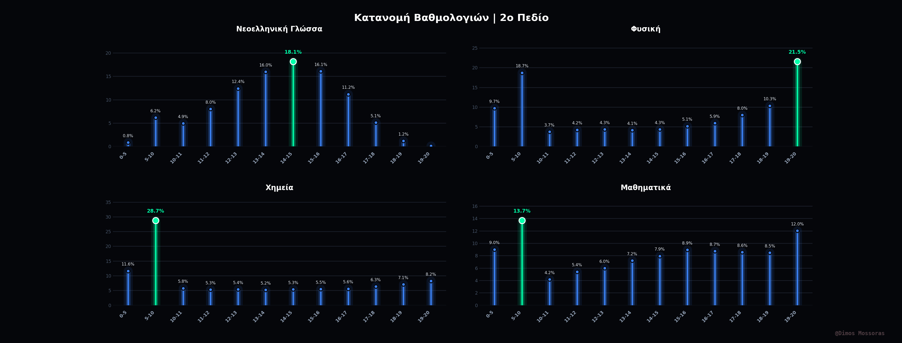
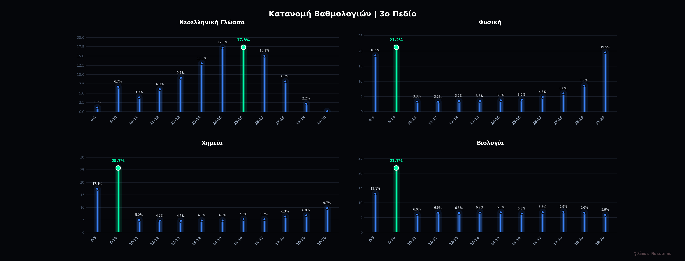
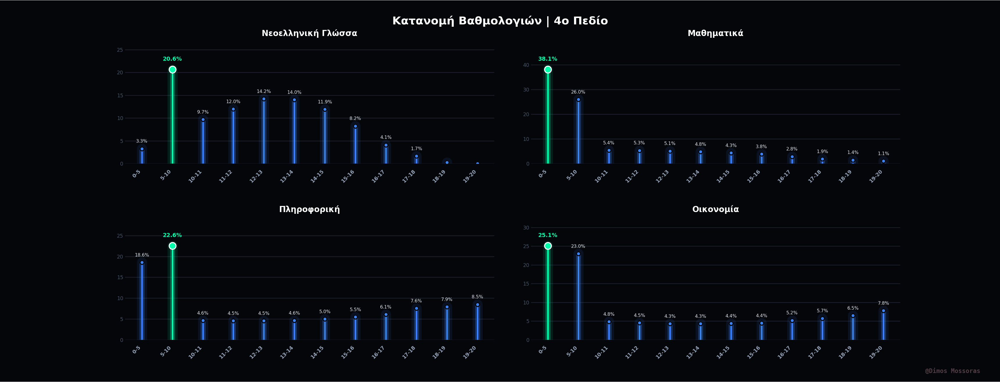

## Πανελλαδικές Εξετάσεις - Κατανομή Βαθμολογιών 📊

Αυτό το repository περιέχει την οπτικοποίηση των στατιστικών βαθμολογιών για τις Πανελλαδικές Εξετάσεις, χωρισμένη στα 4 Επιστημονικά Πεδία. Στόχος του project είναι η καθαρή και άμεση παρουσίαση των επιδόσεων των μαθητών σε κάθε εξεταζόμενο μάθημα.

## 🛠️ Τεχνολογίες & Εργαλεία
* **Γλώσσα:** Python
* **Βιβλιοθήκες:** Pandas (για Data Wrangling), Matplotlib / Seaborn (για Data Visualization)
* Το styling των γραφημάτων έγινε με custom dark theme και highlight (neon green) στη βαθμολογική κλίμακα με τη μεγαλύτερη συγκέντρωση μαθητών.

---

## 📈 Τα Γραφήματα

### 1ο Πεδίο: Ανθρωπιστικές Σπουδές
Περιλαμβάνει Νεοελληνική Γλώσσα, Αρχαία Ελληνικά, Ιστορία και Λατινικά.

### 2ο Πεδίο: Θετικές και Τεχνολογικές Επιστήμες
Περιλαμβάνει Νεοελληνική Γλώσσα, Φυσική, Χημεία και Μαθηματικά.

### 3ο Πεδίο: Επιστήμες Υγείας και Ζωής
Περιλαμβάνει Νεοελληνική Γλώσσα, Φυσική, Χημεία και Βιολογία.

### 4ο Πεδίο: Επιστήμες Οικονομίας και Πληροφορικής
Περιλαμβάνει Νεοελληνική Γλώσσα, Μαθηματικά, Πληροφορική και Οικονομία.

---
*Created by [@ItsDim](https://github.com/ItsDim)*
